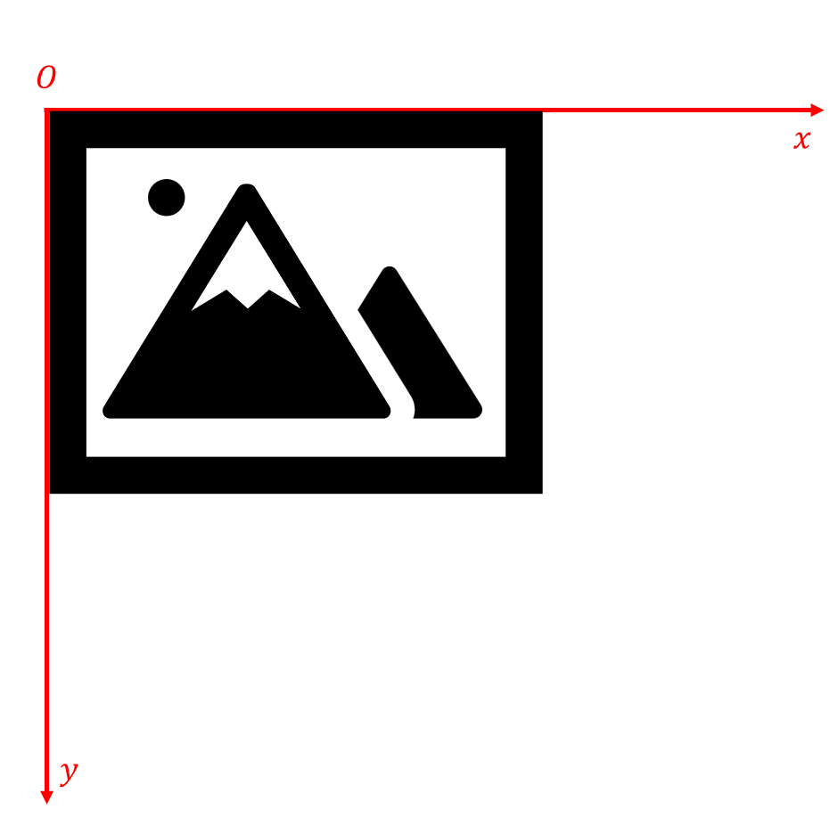
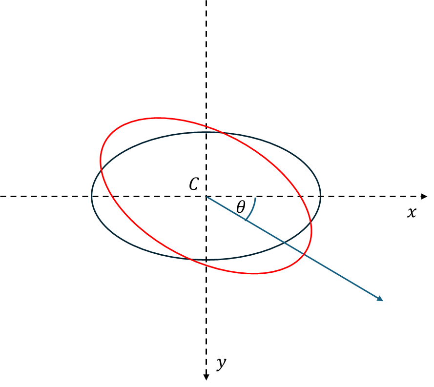

# 1. Ellipse Playground

Given the **image coordinate system** $Oxy$, with $O(0, 0)$ is the **coordinate center**:



## 1.1. General Equation

$$
\frac{[(𝑥−c_x)cos(-\theta)+(𝑦−c_y)sin(-\theta)]^2} {𝑎^2}+\frac{[(𝑥−c_x)sin(-\theta)−(𝑦−c_y)cos(-\theta)]^2}{𝑏^2}=1
$$

given:

- $C(c_x, c_y)$ is the ellipse center
- $a, b$ are the major and minor radius
- $\theta$ is the rotation angle measured from the $Cx$ axis (not $Ox$ axis) (**clockwise order**)

## 1.2. Parametric Equation

$$
x(\alpha)=a{cos(\alpha)}{cos(\theta)} - b{sin(\alpha)}{sin(\theta)}+c_x
$$

$$
y(\alpha)=a{cos(\alpha)}{sin(\theta)}+b{sin(\alpha)}{cos(\theta)}+c_y
$$

given:

- $C(c_x,c_y)$ is the ellipse center
- $a, b$ are the major and minor radius
- $\theta$ is the rotation angle measured from the $Cx$ axis (not $Ox$ axis) (**clockwise order**)
- 𝛼 is the parameter, which ranges (radian) from 0 to 2𝜋



Rotated ellipse illustration, with $Cx$ and $Cy$ are correspondingly paralleled & share the same direction with $Ox$ and $Oy$

# 2. Rotate point

If you rotate a point $B(x_B, y_B)$ around a point $A(x_A, y_A)$ by angle $\theta$ (anti-clockwise order) you'll get a point $C(x_C, y_C)$, in which:

$$
x_C = (x_B - x_A)cos(\theta)+(y_B-y_A)sin(\theta)+x_A
$$

$$
y_C=(x_B-x_A)sin(\theta)+(y_B-y_A)cos(\theta)+y_A
$$

Please refer to this code snipper for Python implementation:
```Python
def get_rotation(start_point, center_point, rad):
    """Find the point T(x_T, y_T) that was made by rotating the point start_point(x_S, y_S) around the center point center_point(x_C, y_C)

    Args:
        start_point: start point as format (x, y)
        center_point: center point as format (x, y)
        rad: rotation angle in radian unit, counterclockwise order
        
    Returns:
        T as shape [x_T, y_T]    
    """    
    
    T = [0, 0]
    T[0] = (start_point[0] - center_point[0]) * math.cos(rad) - (start_point[1] - center_point[1]) * math.sin(rad) + center_point[0]
    T[1] = (start_point[0] - center_point[0]) * math.sin(rad) + (start_point[1] - center_point[1]) * math.cos(rad) + center_point[1]
    
    return T
```
