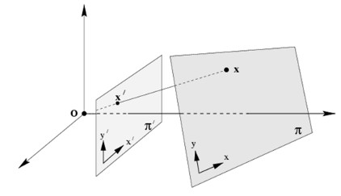
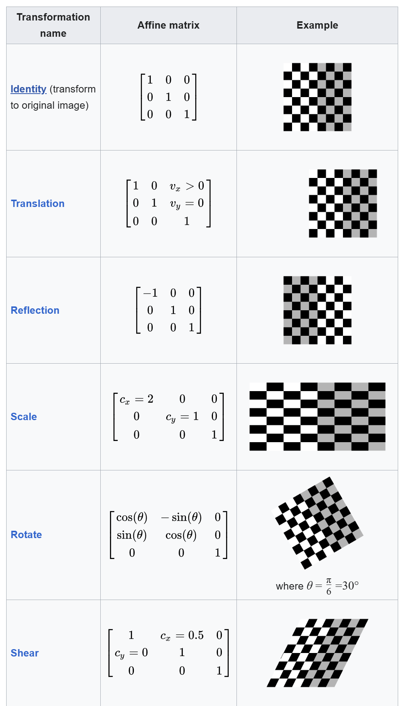

# Perspective Transform

The homography, also known as the perspective transform, is a geometric transformation that relates 2 different planes. Straight lines will remain straight after the transformation:

In the above figure, each point $(x, y)$ of the plane $\pi$ corresponds to a point $(x',y')$ of the plane $\pi'$. Their relation can be represented by the following equation:

$$
s \begin{bmatrix} x^{'} \\ y^{'} \\ 1 \end{bmatrix} = \mathbf{H} \begin{bmatrix} x \\ y \\ 1 \end{bmatrix} = \begin{bmatrix} h_{11} & h_{12} & h_{13} \\ h_{21} & h_{22} & h_{23} \\ h_{31} & h_{32} & h_{33} \end{bmatrix} \begin{bmatrix} x \\ y \\ 1 \end{bmatrix}
$$

given:

- $s$ is a scale factor
- $H$ is a homography matrix that has a shape `3x3` but with 8 DoF (degrees of freedom)

 To find this transformation matrix, you need **4 points** on the **input image** and **corresponding points** on the **output image**. Among these 4 points, **3 of them should not be collinear**.

 --
 # Affine Transformation

## Definition

An **affine transformation** or **affinity** is a [geometric transformation](https://en.wikipedia.org/wiki/Geometric_transformation) that preserves [lines](https://en.wikipedia.org/wiki/Line_(geometry)) and [parallelism](https://en.wikipedia.org/wiki/Parallelism_(geometry)) but not necessarily [Euclidean distances](https://en.wikipedia.org/wiki/Euclidean_distance) and [angles](https://en.wikipedia.org/wiki/Angle). This means that:

- Points on the same line initially lie on a line after the transformation
- Parallel lines before the transformation remain parallel after the transformation
- The ratio of any pair of segments remains the same after the transformation. Hence, a segment's midpoint remains the midpoint.

## **Examples of Affine Transformations:**

- **Translation:** Moving a figure without changing its orientation or size.
- **Rotation:** Turning a figure around a point.
- **Scaling:** Enlarging or shrinking a figure.
- **Shearing:** Skewing a figure.

## Equation

