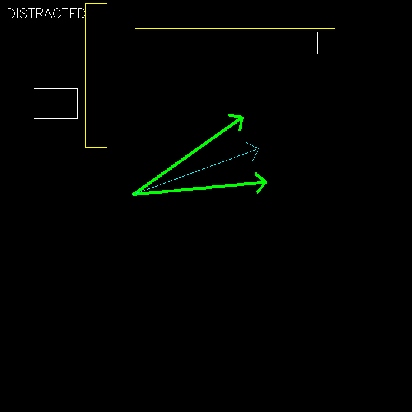
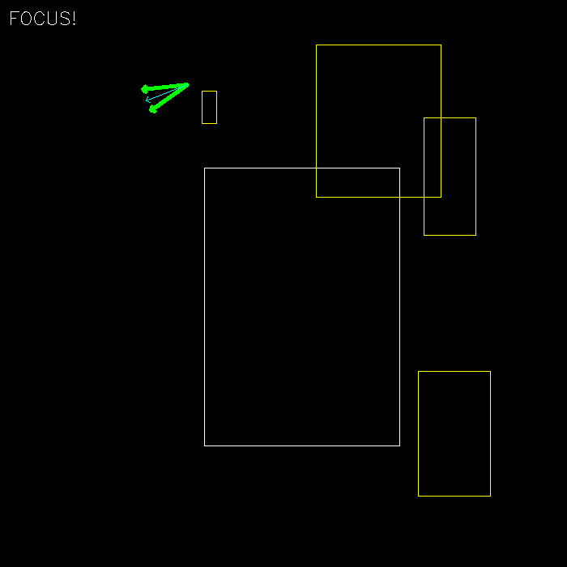

# Introduction

This is a naive algorithm to check **if a person is looking at the Phone** from the input image, given an **Object Detection Model** and **Gaze Estimation Model**

## Idea

We assume that:

- The **Object Detection Model** detects a list of specified object `Phone` + `Human`
- The **Gaze Estimation Model** predicts a human's `gaze vector` (starts from point `gaze_start` and goes toward point `gaze_end`)

Generally, the **Gaze Estimation Model will predict a vector**, but practically, humans don't look at only 1 specific "ray" but a "cone-like" **FOV**. Therefore, we define the gaze's `FOV` as the angle that starts from `gaze_start` and receives the `gaze vector` as the **angle bisector**, the idea is to check if is there is at least 1 `Obj` object **intersects** with the `FOV`. The `Obj` object is considered to **intersect** with the `FOV` if it satisfies 2 conditions:

- (1) The object's confidence score must not be lower than the specific confidence threshold `conf_thres` ($0 < conf\_thres <= 1$). This condition is to reduce the **False Positive** phone detection error.
- (2) The `FOV` must intersect with at least `count_thres` edges of the object's bounding box (1 <= `count_thres` <= 4).

If there is at least 1 `Phone` object that satisfies these conditions, we say that **a person is looking at the phone**.

## Configuration

> These values may be updated after experiments to bring the best possible accuracy
> 
- `conf_thres`: 0.5 (0 < `conf_thres` <= 1)
- `count_thres`: 1 (1 <= `count_thres` <= 4)
- `fov_degree`: 30 (`FOV`'s magnitude, in degree unit, 0 <= `fov_degree` <= 90)

## Demo
In the demo script, I generated a random **gaze_vector**, as well as 5 `Phone` objects. The logic is applied to check if **the human is looking at the Phone** (Distracted) or not (Focus), as you can see in these 2 example images:





In these images, we have:

- **Green vectors** represent `FOV`
- **Light blue vector** represents `gaze vector`
- **Rectangles** are `Phone` objects (assume that all of them belong to class `Phone`):
    - **White rectangles** are the objects that do not satisfy the confidence score condition (1)
    - **Yellow rectangles** are the objects that do not satisfy the bounding box condition (2)
    - **Red rectangles** are the objects that satisfy both conditions

```Python

import cv2
import numpy as np

from loguru import logger

def get_rotation(start_point, center_point, rad):
    """Find the point T(x_T, y_T) that was made by rotating the point start_point(x_S, y_S) around the center point center_point(x_C, y_C)

    Args:
        start_point: start point as format (x, y)
        center_point: center point as format (x, y)
        rad: rotation angle in radian unit, counterclockwise order
        
    Returns:
        T as shape [x_T, y_T]    
    """    
    
    T = [0, 0]
    T[0] = (start_point[0] - center_point[0]) * math.cos(rad) - (start_point[1] - center_point[1]) * math.sin(rad) + center_point[0]
    T[1] = (start_point[0] - center_point[0]) * math.sin(rad) + (start_point[1] - center_point[1]) * math.cos(rad) + center_point[1]
    
    return T

def find_angle(start_point, end_point):
    """Find the angle of the vector start_point->end_point (with respect to Ox axis, in clockwise order)

    Args:
        start_point: start point of the vector as format (x, y)
        end_point: "end" point of the vector as format (x, y)

    Returns: 
        angle in radian
    """    
    return math.atan2(end_point[1] - start_point[1], end_point[0] - start_point[0])

def is_anglerange_in_fovrange(fov_min, fov_max, angle_1, angle_2):
    """Check if the angle range [min(angle_1, angle_2), max(angle_1, angle_2)] is inside/overlaps with the FOV range [fov_min, fov_max]

    Args:
        fov_min (float): lower bound of the fov range (in radian unit, -pi <= range_min <= pi)
        fov_max (float): upper bound of the fov range (in radian unit, -pi <= range_max <= pi)
        angle_1 (float): first bound of the angle range  (in radian unit, -pi <= angle_1 <= pi)
        angle_2 (float): second bound of the angle range  (in radian unit, -pi <= angle_1 <= pi)
        
    Constraint:
        0 <= fov <= math.pi / 2 (90 degree)
        0 <= angle <= math.pi (180 degree)
        fov_min <= fov_max
    Returns:
        True if angle range the FOV range, False otherwise
    """    
    
    angle_min = min(angle_1, angle_2)
    angle_max = max(angle_1, angle_2)

    if fov_min <= 0 and fov_max >= 0:
        if fov_min >= -math.pi / 2:                                 ## -math.pi / 2 <= fov_min <= 0 && 0 <= fov_max <= math.pi / 2
            logger.info("case 1")
            if angle_max < fov_min:                                 # -math.pi <= angle_max < fov_min
                return False
            elif angle_max <= fov_max:                              # fov_min <= angle_max <= fov_max
                return True
            elif angle_max <= fov_min + math.pi:                    # fov_max < angle_max <= fov_min + math.pi
                return angle_max - math.pi <= angle_min <= fov_max
            else:                                                   # fov_min + math.pi < angle_max <= math.pi
                return fov_min <= angle_min <= fov_max
        else:                                                       ## -math.pi <= fov_min <= -math.pi / 2 && math.pi / 2 <= fov_max <= 0
            logger.info("case 2")
            if angle_max <= fov_min:                                # -math.pi <= fov_min <= -math.pi / 2
                return True
            elif angle_max <= 0:                                    # fov_min < angle_max <= 0
                return angle_min <= fov_min
            elif angle_max < fov_max:                               # 0 < angle_max < fov_max
                return angle_min <= angle_max - math.pi   
            else:                                                   # fov_max <= angle_max <= math.pi 
                return True      
    else: 
        if fov_max <= 0:     
            logger.info("case 3")
            ## fov_min <= fov_max <= 0
            if angle_max < fov_min:                                 # -math.pi <= angle_max < fov_min
                return False
            elif angle_max <= fov_max:                              # fov_min <= angle_max <= fov_max
                return True
            elif angle_max <= fov_max + math.pi:                    # fov_max < angle_max <= fov_max + math.pi
                return angle_max - math.pi <= angle_min <= fov_max
            else:                                                   # fov_max + math.pi < angle_max <= math.pi
                return fov_min <= angle_min <= angle_max - math.pi
        else:                                               ## 0 <= fov_min <= fov_max
            logger.info("case 4")
            if angle_max < 0:                               # -math.pi <= angle_max < 0
                return False
            elif angle_max < fov_min:                       # 0 <= angle_max < fov_min
                return angle_min <= angle_max - math.pi
            elif angle_max <= fov_max:                      # fov_min <= angle_max <= fov_max
                return True
            else:                                           # fov_max < angle_max <= math.pi
                return angle_max - math.pi <= angle_min <= fov_max
    return False

def is_overlapped(bbox1, bbox2):
    """Check if the 2 bounding boxes are overlapped with each other (True) or not (False)

    Args:
        bbox1: the first bounding box as format [xmin, ymin, xmax, ymax(, conf)]
        bbox2: the second bounding box as format [xmin, ymin, xmax, ymax(, conf)]

    Returns:
        True if bbox1 is overlapped with bbox2, False otherwise
    """
    horizontalValid = False
    verticalValid = False
    
    if (bbox1[0] <= bbox2[2] and bbox1[0] >= bbox2[0]):
        horizontalValid = True
    elif (bbox2[0] <= bbox1[2] and bbox2[0] >= bbox1[0]):
        horizontalValid = True

    if (bbox1[1] <= bbox2[3] and bbox1[1] >= bbox2[1]):
        verticalValid = True
    elif (bbox2[1] <= bbox1[3] and bbox2[1] >= bbox1[1]):
        verticalValid = True

    return (horizontalValid and verticalValid)

def find_intersect_obj_indices(gaze_start, gaze_end, objects, bbox, fov_degree=30, conf_thres=0.5, count_thres=1):
    """Check if any object intersects with the "fov" that starts from "gaze_start" and receives gaze vector as the angle bisector

    Args:
        - gaze_start: start point of the gaze vector as format (x, y)
        - gaze_end: "end" point of the gaze vector as format (x, y)
        - objects: list of objects, each object has format [xmin, ymin, xmax, ymax, conf] (xmin, ymin, xmax, ymax is bounding box, conf is confidence score)
        - bbox: only use objects which are overlapped with the bounding box bbox [xmin, ymin, xmax, ymax(, conf)]
        - fov_degree (int, optional): the absolute value of the "fov" in Degree unit. Defaults to 30 (this is a configuration value, and must be >= 0 and < 90)
        - count_thres (int, optional): the minimum number of corners that lie within "gaze angle" to be considered as "intersect". Default to 1 (this is a configuration value, and must be >= 1 and <= 4)
        - conf_thres (float, optional): confidence threshold as many false positive "Phone" detection may appear. Default to 0.5 (this is a configuration value, and must be > 0 and < 1)
    Returns:
        - fov_p1: the point to represent the first vector of the "fov" as format (x, y)
        - fov_p2: the point to represent the second vector of the "fov" as format (x, y)
        - intersect_obj_indices: indices of intersect objects (if any)
        - outside_obj_indices: indices of object outside of the bbox (if any)
        - unseen_obj_indices: indices of object inside of the bbox but is not looked at (if any)
    """    
    
    # convert angle to radian unit
    rad = math.pi * fov_degree / 360
    
    #find 2 points represent 2 vectors of the "gaze angle"
    fov_p1 = get_rotation(gaze_end, gaze_start, rad)
    fov_p2 = get_rotation(gaze_end, gaze_start, -rad) 
    
    fov_a1 = find_angle(gaze_start, fov_p1) 
    fov_a2 = find_angle(gaze_start, fov_p2)   
    
    fov_amin = min(fov_a1, fov_a2)
    fov_amax = max(fov_a1, fov_a2)

    logger.info("fov_amin: {}".format(fov_amin * 180 / math.pi))
    logger.info("fov_amax: {}".format(fov_amax * 180 / math.pi))

    intersect_obj_indices = list()
    outside_obj_indices = list()
    unseen_obj_indices = list()
    
    for idx, obj in enumerate(objects):

        if is_overlapped(obj, bbox) is False:
            outside_obj_indices.append(idx)
            continue
        
        # make sure object's confidence score satisfies the confidence threshold
        if obj[4] >= conf_thres:
            logger.info("object {}".format(idx))
            count = 0
        
            # 4 corners of the object bounding box, in order is top-left, top-right, bottom-left, bottom-right
            corner_pts = [(obj[0], obj[1]), (obj[0], obj[3]), (obj[2], obj[1]), (obj[2], obj[3])]
            
            # the angle from "gaze_start" to each corner
            corner_angles = list()
            for corner_pt in corner_pts:
                corner_angle = find_angle(gaze_start, corner_pt)
                logger.info("corner: {}".format(corner_angle * 180 / math.pi))
                corner_angles.append(corner_angle)#find_angle(gaze_start, corner_pt))
                            
            # check if the FOV intersects with the top edge (from top-left corner to top-right corner)
            if is_anglerange_in_fovrange(fov_amin, fov_amax, corner_angles[0], corner_angles[1]):
                count += 1
            
            # check if the FOV intersects with the bottom edge (from bottom-left corner to bottom-right corner)
            if is_anglerange_in_fovrange(fov_amin, fov_amax, corner_angles[2], corner_angles[3]):
                count += 1
            
            # check if the FOV intersects with the left edge (from top-left corner to bottom-left corner)
            if is_anglerange_in_fovrange(fov_amin, fov_amax, corner_angles[0], corner_angles[2]):
                count += 1            

            # check if the FOV intersects with the right edge (from top-right corner to bottom-right corner)
            if is_anglerange_in_fovrange(fov_amin, fov_amax, corner_angles[1], corner_angles[3]):
                count += 1   
            
            # object's bounding box intersects with the FOV
            if count >= count_thres:
                logger.warning("INSIDE!")
                intersect_obj_indices.append(idx)
            else:
                logger.warning("OUTSIDE!")
                unseen_obj_indices.append(idx)
    
    return fov_p1, fov_p2, intersect_obj_indices, outside_obj_indices, unseen_obj_indices

def generate_object(image_size):
    """Generate a random object

    Args:
        image_size (int): input image size (width = height = image_size)

    Returns:
        object as format [xmin, ymin, xmax, ymax, conf] (xmin, ymin, xmax, ymax is bounding box, conf is confidence score)
    """    
    xmax = np.random.randint(1, image_size)
    xmin = np.random.randint(xmax)
    
    ymax = np.random.randint(1, image_size)
    ymin = np.random.randint(ymax)
    
    # confidence score
    conf = np.random.rand()
    
    return [xmin, ymin, xmax, ymax, conf]

def generate_gaze(bbox):
    """Generate a "gaze vector" that starts from gaze_start and goes toward "gaze_end"

    Args:
        image_size (int): input image size (width = height = image_size)

    Returns:
        gaze_start as format (x, y)
        gaze_end as format (x, y)
    """    
    while True:
        gaze_start_x = np.random.randint(bbox[0], bbox[2])
        gaze_start_y = np.random.randint(bbox[1], bbox[3])
        
        gaze_end_x = np.random.randint(bbox[0], bbox[2])
        gaze_end_y = np.random.randint(bbox[1], bbox[3])

        # gaze_start = np.random.randint(image_size, size=2)
        # gaze_end = np.random.randint(image_size, size=2)
        
        # # to make sure "gaze_start" and "gaze_end" are not the same point
        if gaze_start_x != gaze_end_x or gaze_start_y != gaze_end_y:
            break
    
    return (gaze_start_x, gaze_start_y), (gaze_end_x, gaze_end_y)

if __name__ == "__main__":
    
    #configuration
    fov_degree = np.random.randint(30, 91) #90
    logger.info("fov degree: {}".format(fov_degree))
    conf_threshold = 0.5
    count_threshold = 1
    
    # image size
    image_size = 700
    
    # number of objects
    num_objects = 10
    
    # generate objects
    objects = list()
    for i in range(num_objects):
        obj = generate_object(image_size)
        objects.append(obj)
        
    # generate human bouding box
    human = generate_object(image_size)
        
    #generate gaze vector
    gaze_start, gaze_end = generate_gaze(human)
    
    # find the list of object inside "fov"
    fov_p1, fov_p2, intersect_obj_indices, outside_obj_indices, unseen_obj_indices = find_intersect_obj_indices(gaze_start, gaze_end, objects, human, fov_degree=fov_degree, conf_thres=conf_threshold)#, count_thres=count_threshold)
    
    # image    
    image = np.zeros((image_size, image_size, 3), dtype=np.uint8)

    # visualize human bounding box
    cv2.rectangle(image, (human[0], human[1]), (human[2], human[3]), (255, 0, 0))
    
    # visualize fov (green)
    fov_color = (0, 255, 0)
    cv2.arrowedLine(image, gaze_start, (int(fov_p1[0]), int(fov_p1[1])), fov_color, 3)
    cv2.arrowedLine(image, gaze_start, (int(fov_p2[0]), int(fov_p2[1])), fov_color, 3)
    
    # visualize gaze vector (sky blue)
    gaze_color = (255, 255, 0)
    cv2.arrowedLine(image, gaze_start, gaze_end, gaze_color, 1)
    
    # visualize object
    for idx, obj in enumerate(objects):
        
        if idx in intersect_obj_indices: # object in fov, color in red
            color = (0, 0, 255)
        elif idx in outside_obj_indices: #object outside human bounding box, color in white
            color = (255, 255, 255)
        elif idx in unseen_obj_indices: # object out of fov and inside human bounding box, color in yellow
            color = (0, 255, 255)  
        else:
            continue
        # if obj[4] >= conf_threshold:    
        cv2.rectangle(image, (obj[0], obj[1]), (obj[2], obj[3]), color)
    
    # the human is looking at a phone
    if len(intersect_obj_indices) > 0:
	      cv2.putText(image, "LOOKING AT PHONE!", (10, 30), cv2.FONT_HERSHEY_SIMPLEX, 0.75, (255, 255, 255))
        
    cv2.imshow("preview", image)
    cv2.waitKey()
    
    cv2.imwrite("example.png", image)
```
